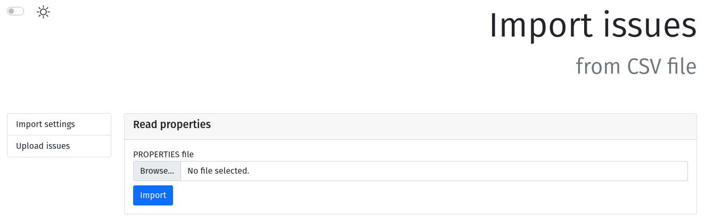

[](https://github.com/BranislavBeno/GitLab-Issue-Importer/actions/workflows/tests.yml)
[](https://github.com/BranislavBeno/GitLab-Issue-Importer/actions/workflows/deploy.yml)  
[](https://sonarcloud.io/summary/new_code?id=BranislavBeno_GitlabIssueImporter)
[](https://sonarcloud.io/summary/new_code?id=BranislavBeno_GitlabIssueImporter)
[](https://sonarcloud.io/summary/new_code?id=BranislavBeno_GitlabIssueImporter)  
[](/build.gradle)
[](/build.gradle)
[](/build.gradle)
[](/gradle/wrapper/gradle-wrapper.properties)
[](https://opensource.org/licenses/MIT)

## Web application for importing issues into Gitlab

This web application offers to import issues from other ticketing system into Gitlab.  
Currently, is supported *ClearQuest* system and its issues must be provided in form of CSV file.  
However, it's relatively easy to extend application for other ticketing systems.

### Installation
Preferred way of installation is to pull and run prepared docker image `docker pull beo1975/gitlab-issue-importer:1.0.0`.  
Precondition is to have `docker` installed on the target system.

Alternatively is possible to build and run the application as a fat jar on any operating system with `Java 19` installed.

Application expects only running instance of Gitlab into which the issues will be imported.
No other services (e.g. databases, message brokers,...) are required.

### Usage
Application is simple web server, which by default listens on port 8080.  
For successful issues import is necessary to set required parameters over web UI.

There are two ways how to proceed:
1. Upload all necessary parameters from prepared `properties` file, e.g.:
``` properties
   project.url=https://gitlab.com
   project.id=31643739
   project.access.token=gitlab-access-token
   csv.type=ClearQuest
   csv.delimiter=;
```
In this case user uploads chosen `properties` file over `Import settings` view.


2. Set all necessary parameters manually

In this case user sets up necessary parameters manually over `Upload issues` view.


In both cases user must choose file with issues, which are going to be imported.
The result will be shown on `Results` view.


### Supported ticketing systems
#### ClearQuest
Input CSV file must contain at least following columns:
- Headline
- CFXID
Otherwise import ends with error.

Following columns from CSV file are also processed:
- Description
- SystemStructure
- CCBNotesLog
- NotesLog
- Attachments

Any other columns are ignored during import.